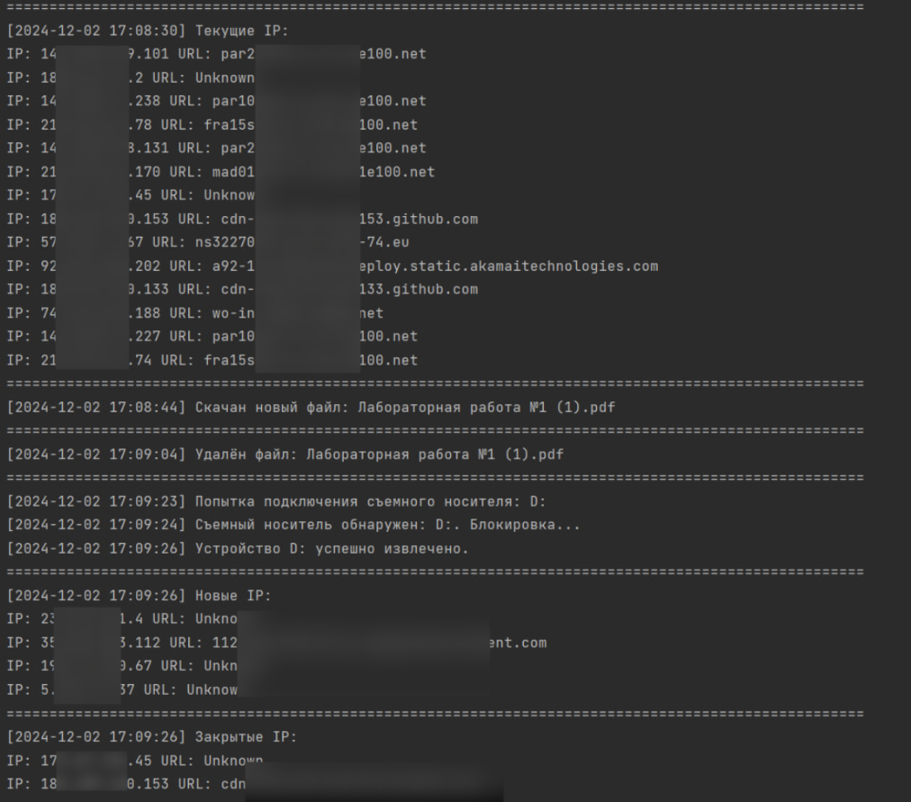

# Концепт DLP-системы

Учебный проект, в рамках которого был создан образ DLP-системы. Так как это не полноценный проект, вся информация выводится в консоль. Инциденты отслеживаются в непрерывном режиме до тех пор, пока сам пользователь не прервёт выполнение программы. 

***Предполагается, что данная DLP-система направлена на:***
- **Реальный мониторинг сетевого трафика браузеров сотрудников** - то позволяет выявлять попытки передачи конфиденциальных данных или доступ к несанкционированным ресурсам.
- **Контроль операций с файлами** - система будет фиксировать и предупреждать скачивание или удаление важных документов, предотвращая возможные утечки данных.
- **Обнаружение неавторизованных съемных носителей** - подключение внешних устройств автоматически блокируется, а о попытках подключения формируется уведомление для администратора.

В рамках учебного проекта был выполнен поверхностный анализ. Возможно усовершенствование функционала для применения его в реальных проектах.

**Пример работы программы:**

